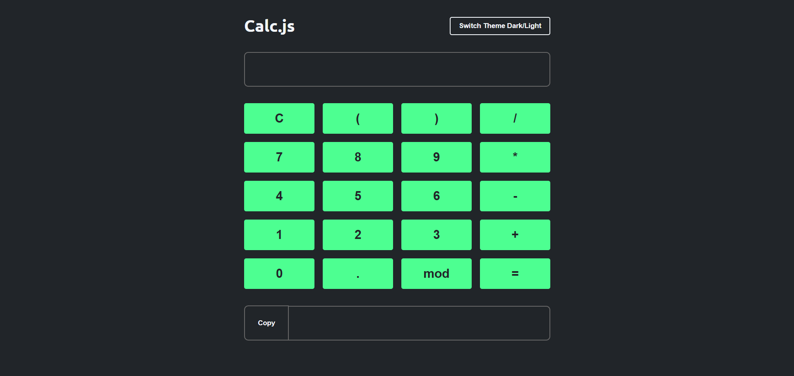

# 🧮 Calc.js — Calculadora Simples

Uma calculadora funcional feita durante o curso da OneBitCode com **HTML5**, **CSS3** e **JavaScript** moderno (módulos ES6).

## Prévia da calculadora

## ✨ Funcionalidades

- 🔢 Entrada de expressões matemáticas via botões ou teclado.
- 🧮 Cálculo de expressões com suporte a operadores básicos e parênteses.
- ⚠️ Feedback visual para erros de cálculo.
- 📋 Cópia do resultado para a área de transferência com confirmação visual.
- 🎨 Alternância entre tema escuro e claro usando variáveis CSS customizadas.

---

## 🛠️ Tecnologias utilizadas

-  — estrutura da interface.
-  — estilos, layout responsivo e temas dinâmicos.
-  — lógica, eventos e manipulação do DOM.

---

## 🚀 Como usar

1. Digite ou use os botões para montar sua expressão.
2. Clique em **=** ou pressione **Enter** para calcular.
3. Clique em **Copy** para copiar o resultado.
4. Use o botão **Switch Theme** para alternar entre os temas claro e escuro.

---

## 📝 Sobre o projeto

Projeto ideal para praticar:

- Modularização de código em JavaScript.
- Manipulação do DOM.
- Aplicação de temas dinâmicos com CSS.

---
## ✅ Inicialização
Esse projeto foi desenvolvido nos ambientes:

